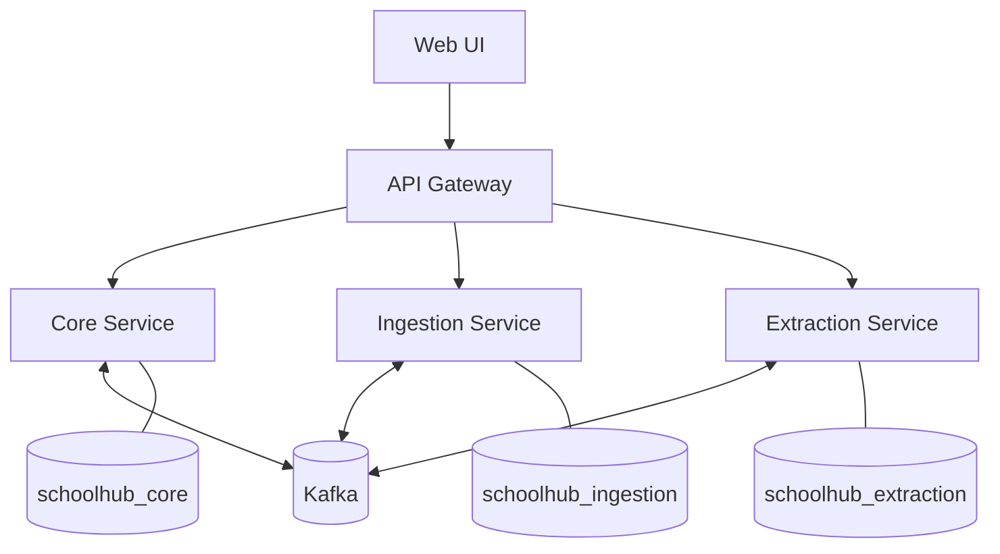

# School Hub

One dashboard for parents juggling multiple children's school tasks, deadlines, and permission slips across Google Classroom, Viber, and paper notices.

> **Status:** In active development. See [Roadmap](#roadmap) for what is built and what is planned.

---

## The problem

A parent with three children in school receives information from a genuinely fragmented set of sources:

- Google Classroom (per child, sometimes per teacher)
- School Gmail accounts and guardian summary emails
- Viber class group chats
- School portals and websites
- Printed notices sent home in a bag
- Verbal reminders relayed by the child

None of these systems talk to each other, and none of them are organised around the question a parent actually asks each morning:

> **What does each of my children need to do, bring, submit, attend, or prepare for today?**

Existing task managers do not solve this. They are organised around the parent's projects, not around children, and they require the parent to do the aggregation manually anyway.

## The solution

School Hub does not attempt to replace any of those systems. It sits on top of them and provides a single parent-facing view organised by **child**, not by source application.

Two design commitments follow from that:

- **Action over information.** "Sign the field trip waiver" outranks "school announcement." Parent responsibilities are a distinct item type and are visually separated from student assignments, because they are the ones most easily missed.
- **Human-confirmed automation.** Imported data does not silently become trusted data. Anything the system is uncertain about lands in an Inbox for review before it appears on the dashboard.

---

## Screenshots

> All screenshots use seeded demo data. No real household or school information appears anywhere in this repository.

| Family dashboard | Child dashboard |
| --- | --- |
| _(screenshot pending)_ | _(screenshot pending)_ |

| Quick add | Inbox review |
| --- | --- |
| _(screenshot pending)_ | _(screenshot pending)_ |

---

## Architecture



Three services, each with its own MySQL database and no cross-database access. They communicate over Kafka.

| Service | Responsibility | Why it is separate |
| --- | --- | --- |
| **Core** | Children, school items, status transitions, dashboard queries | Transactional, strongly consistent, stable. The source of truth. |
| **Ingestion** | Google OAuth, Classroom sync, sync run history | Talks to a rate-limited external API with its own retry and failure semantics. Must not degrade the dashboard when Google is slow. |
| **Extraction** | Parsing pasted text, classifying student task vs parent action, confidence scoring | Different runtime profile and release cadence. Designed to be replaceable by an ML-backed implementation without touching the other services. |

The gateway handles authentication and routing so that no individual service is exposed directly.

### Why microservices here

Splitting a single-household application into services is usually over-engineering, so it is worth stating the reason explicitly rather than assuming it.

The forcing constraint is **idempotent ingestion**. A Google Classroom sync can run twice, a Kafka consumer can see the same event twice, and a coursework item can be edited upstream after it was already imported. In every one of those cases the dashboard must end up with exactly one item, updated rather than duplicated.

Solving that properly requires a transactional outbox on the producing side, an external-ID-based idempotency key on the consuming side, and consumers that can safely reprocess. That is a real distributed systems problem, not a manufactured one, and it is the reason the boundaries fall where they do.

Where a boundary is *not* justified, it is not drawn. Calendar and search are features of the core service, not services of their own.

---

## Tech stack

| Layer | Technology |
| --- | --- |
| Language | Java 21 |
| Framework | Spring Boot 3.x |
| Gateway | Spring Cloud Gateway |
| Security | Spring Security, OAuth2 client (Google) |
| Messaging | Apache Kafka |
| Persistence | MySQL 8, Spring Data JPA, Flyway |
| Resilience | Resilience4j (circuit breaker on the Google adapter) |
| Testing | JUnit 5, Testcontainers (real MySQL and Kafka) |
| Observability | Micrometer, OpenTelemetry |
| Frontend | React, Vite, Tailwind CSS |
| Local orchestration | Docker Compose |

---

## Running locally

**Prerequisites:** Docker and Docker Compose. Nothing else is required — the JDK, MySQL, and Kafka all run in containers.

```bash
git clone https://github.com/<your-username>/school-hub.git
cd school-hub
cp .env.example .env
docker compose up -d
```

The application will be available at <http://localhost:3000>.

### Demo data

```bash
docker compose exec core ./seed-demo.sh
```

This creates three demo children (Emma, Lucas, and Sofia) with a realistic spread of assignments, parent actions, events, overdue items, and completed items. Google integration is not required to explore the application.

### Running the tests

```bash
./mvnw verify
```

Integration tests use Testcontainers and will start real MySQL and Kafka containers. Docker must be running.

---

## Technical decisions

**Database per service, not a shared database.** Each service owns `schoolhub_core`, `schoolhub_ingestion`, or `schoolhub_extraction` with its own credentials. Cross-database joins are not possible by design. Services exchange data through events, not through each other's tables.

**Transactional outbox.** The ingestion service writes the imported item and its outgoing event in the same database transaction, then a separate relay publishes to Kafka. This removes the dual-write problem where a database commit succeeds but the message publish fails.

**Idempotency by external ID.** Every imported item carries the source system's identifier (for example, the Google Classroom coursework ID). Consumers upsert on that key, so redelivery updates the existing record rather than creating a duplicate.

**Adapter pattern at every integration boundary.** `GoogleClassroomAdapter`, `GmailAdapter`, and `ManualInputAdapter` all produce the same normalised item. Google-specific types never leave the ingestion service, which keeps adding a future source a contained change.

**Circuit breaker on outbound Google calls.** A slow or failing Google API degrades sync only. The dashboard continues to serve items already stored.

**Human review by default.** Imported items enter an Inbox with a confidence score attached rather than appearing directly on the dashboard. Bypassing review for high-confidence items is deliberately deferred until there is real usage data to justify a threshold.

---

## Privacy

This application handles information about children, so privacy is treated as a requirement rather than a later concern.

- All data is stored locally in containers on the host machine. There is no hosted backend.
- No telemetry, analytics, or crash reporting is sent to any third party.
- Usage metrics are stored locally and never transmitted.
- No real household or school data is committed to this repository. All screenshots and documentation use seeded demo children.
- OAuth tokens are stored encrypted and are deleted when the integration is disconnected.
- Application logs deliberately avoid recording full email or message bodies.

---

## Roadmap

**V1 — in progress**

- [ ] Child and school item management
- [ ] Family dashboard with today, upcoming, and overdue views
- [ ] Parent actions as a distinct, prominently surfaced item type
- [ ] Quick add with sub-ten-second capture
- [ ] Google Classroom import with duplicate prevention
- [ ] Inbox review workflow
- [ ] Local usage analytics

**V2 — planned**

Calendar view, full-text search and filtering, natural-language quick add, paste-a-message extraction, daily digest, co-parent sharing, mobile PWA.

**Explicitly out of scope**

School administration, teacher or student accounts, payments, messaging, school portal scraping, and multi-tenant hosting. This is a tool for one household.

---

## License

MIT
